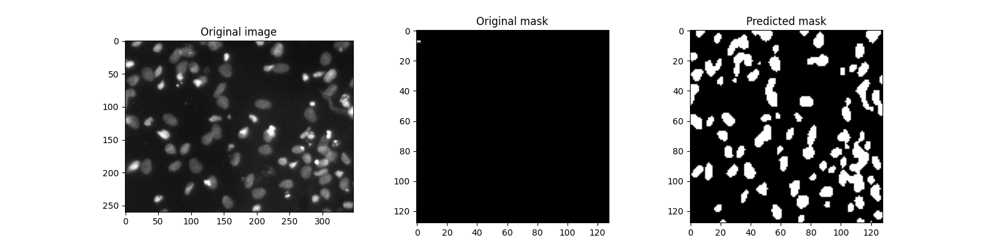

## Description
#### Data preparation
1) For each image from the training set, a single mask of 128 by 128 is formed.
2) For internal testing of the model, a validation set was formed (10% of the labeled data).
#### Exploratory data analysis
1) PCA of the original images in the HSV color space has been carried out.
2) Two main components were visualized. The resulting scatter plot showed four clusters.
3) The KMeans clustering method was applied to the PCA results, the results of which coincided with the visual guess - there are four clusters in the data.
4) The division of images into clusters is uneven: white-on-black images prevail (81.5%), black-on-white images are least of all (2.18%).
5) The training, validation, and test sets do not differ much from each other in the percentage of images of each of the identified clusters.
#### Data augmentation
1) To prevent overfitting, offline image augmentation was performed (rotations 90 degrees, horizontal and vertical shift, zoom, flipping).
2) Also, the random distortion of the image color was carried out during augmentation.
3) Augmentation was carried out in such a way as to correct the inequality in the number of elements in the clusters identified during the research analysis of the data. For the smallest cluster, the most augmented versions were created, for the largest - the least.
#### Model
* Used a standard U-Net. The size of the input layer is 128 by 128 by 3. There are 16 kernels in the input layer.
* Optimizer is Adam with a decaying by schedule learning rate.
* Loss function is Dice_loss.
* Metric is Dice.
* Batch size is 16.
* Dropout and batch normalization were not used, since they did not show a significant improvement in convergence, but they greatly slowed down the learning process.
* During training, control was made on automatically  generated validation set (10% of train + augmented data).
#### Results
* Mean Dice score on each image from train dataset is 0.89.
* Mean Dice score on each image from validation dataset is 0.88.
* There is one image (which randomly fell into the training set) for which the Dice score is low (zero). Looking at this image, one can assume that it has mistaken markup:

## Setup development environment
#### Setting up
1) Install Python 3.8.
2) Clone the repo.
```console
git clone https://github.com/aleks-iv/2018-Data-Science-Bowl-test-task
```
3) Install the necessary required packages from requirements.txt.
```console
pip install -r requirements.txt
```
#### Running
* All necessary data for training and testing are already in repo. (Optionally it's possible to obtain this data by downloading to the root directory of project original data from Kaggle (directories stage1_train and stage1_test) and run the script data_preparation.py).
* Augmented images are already in repo too. (Optionally it's possible to obtain augmented data from original by running script augmentation.py. This script needs list of images per each cluster obtained during EDA. It can be automatically generated and saved as .csv files in ../data/train/ by running EDA notebook).
* For training the model you need to run script Train.py.
* For testing the model you need to run script Predict_masks.py (You can find saved predicted masks in ../data/test/predicted).
